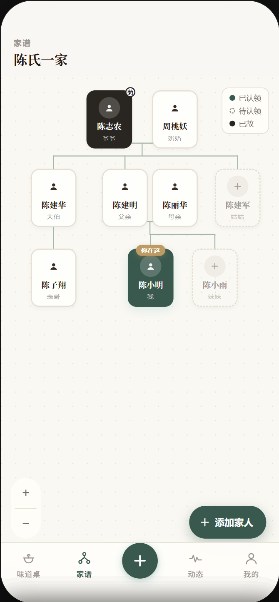
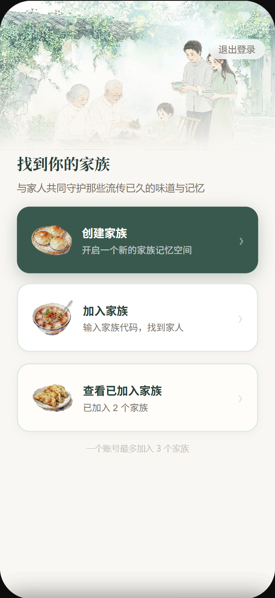
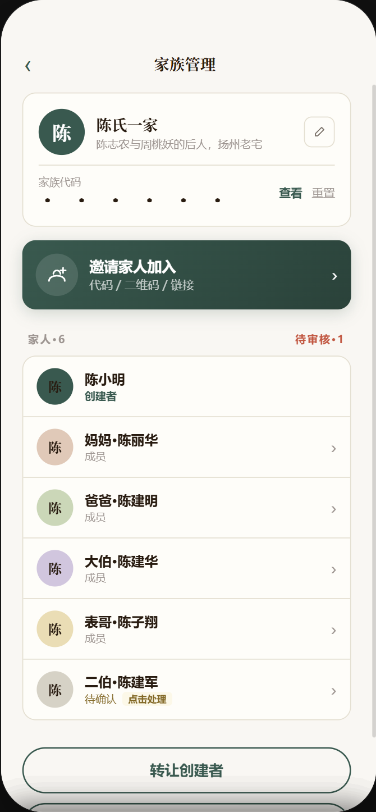
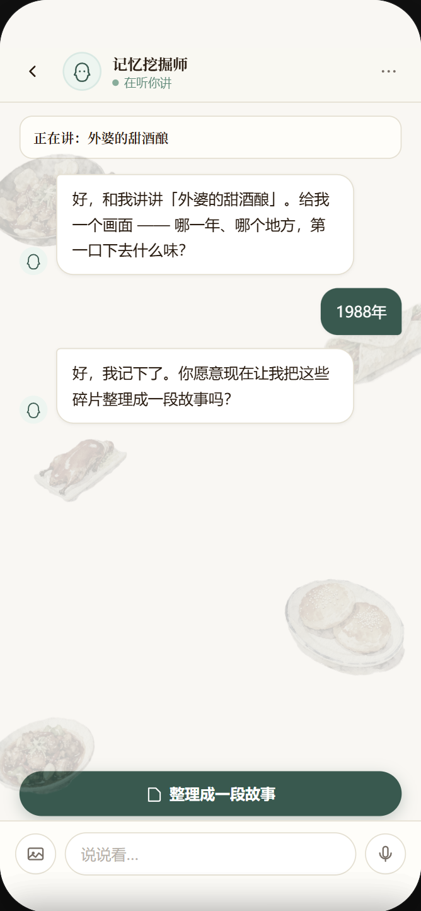
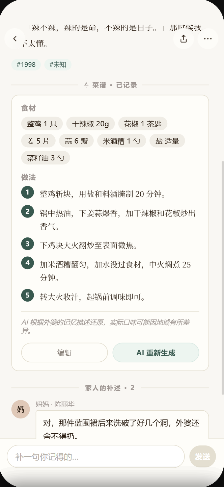

# 一家食光 · Tastes of Home

> **食有来处，家有回声**
>
> 以一道家味为线索，把一家人散落的记忆、关系与传承，重新连回来。

一款由 AI 驱动的家族味觉记忆 App：用一个温暖的"AI 家人"陪你把每道家常菜背后的故事讲出来，自动整理成带插画的记忆，并连接到自动推导的家谱上，让一家人的味道与往事被留存、被看见、被传承。


<p align="center">
  
  
  
</p>

---

## 项目简介

**一家食光（Tastes of Home）** 是一个帮助家庭"抢救并延续味觉记忆"的移动应用。

**它解决什么问题？** 家庭记忆的流失是不可逆的——长辈的手艺和故事没有出口，中间一代不知道该怎么问，漂泊在外的年轻人复刻不出家的味道、也离家族越来越远。市面上的相册、家庭群聊、社交动态都接不住"一个家族的味道与往事"。一家食光以"食物"作为最温柔的入口，把这些正在消散的东西沉淀下来。

**它是做什么的？** 用户围绕一张"味道桌"，由 AI 对话引导讲出每道家常菜背后的人与记忆，系统自动整理成图文故事并挂接到家谱节点上，家人之间可以补充、互动、复刻与传承。

### 核心功能（Features）

- 🍲 **味道桌**：一个家族所有"已点亮"吃食的主页，每道菜背后都连着一个人和一段记忆。
- 🤖 **记忆挖掘 Agent**：一个"不像 AI"的 AI 家人，像聊天一样把你心里的画面问出来，整理成带插画的故事。
- 🌳 **自动家谱推导**：用户只需用 6 种基础关系"定位"自己，系统自动推导出全家任意两人的双向称呼（含堂表、伯叔长幼判定）。
- 🪝 **抛个钩子 / 还有人在等**：把一道你想听的菜邀请家人来讲；AI 也会在对话中自动发现待讲的菜并留好位置。
- 🗺️ **记忆地图 / 时间轴**：每道菜落在具体城市与年份，家族的迁徙与岁月会在地图与时间轴上显形。
- ⏳ **时间胶囊**：把一段故事封存到未来某天开启，甚至可以送给还没出生的家人。
- 📖 **纪念册导出**：把家族记忆整理成可导出的图文册。
- 🔒 **细粒度隐私**：每条贡献独立设置可见范围，所有聚合视图按查看者权限过滤。

---

## 目录

- [项目简介](#项目简介)
- [写在前面：一道菜的重量](#写在前面一道菜的重量)
- [三个让我们决定动手的瞬间](#三个让我们决定动手的瞬间)
- [我们到底在和什么对抗](#我们到底在和什么对抗)
- [我们的答案：让味道成为家的入口](#我们的答案让味道成为家的入口)
- [一条完整的旅程：从一个名字到一段被留住的时光](#一条完整的旅程从一个名字到一段被留住的时光)
- [第一个硬核：一个"不像 AI"的 AI](#第一个硬核一个不像-ai的-ai)
- [第二个硬核：用户只"定位"，系统算出整个家族](#第二个硬核用户只定位系统算出整个家族)
- [我们替用户想到的那些"万一"](#我们替用户想到的那些万一)
- [一个温情产品，为什么要在"不温情"的边界上较真](#一个温情产品为什么要在不温情的边界上较真)
- [技术栈与项目结构](#技术栈与项目结构)
- [安装说明（Installation）](#安装说明installation)
- [运行指南（Usage / How to Run）](#运行指南usage--how-to-run)
- [团队](#团队)

---

## 写在前面：一道菜的重量

请你现在闭上眼睛，想一道菜。

不是餐厅里的招牌菜，而是那道——只有家里某个人能做出来、你走到天涯海角都复刻不了的菜。也许是外婆的红烧肉，深琥珀色、亮晶晶的；也许是爷爷过年时调的那碗酸汤，自家酿的老陈醋，酸辣得冬天吃了浑身暖；也许是你爸只会做、却做了二十年的炸酱面，黄瓜丝必须切得细细的，他说"没有黄瓜丝的炸酱面没有灵魂"。

我们都以为这些味道会一直在。

直到有一天，做菜的那个人走了，那个味道就跟着 TA 一起，永远地走了。你妈试着做过，步骤一样、调料一样，可就是差了点什么——后来你才明白，**差的从来不是调料，是那个人**。

> **死亡不是终点，遗忘才是。**
>
> 一个人真正的离开，不是 TA 停止呼吸的那一刻，而是这世上最后一个记得 TA 的人，也把 TA 忘了的那一刻。而记忆最先褪色的，往往就是那些日常到不会有人特意记录的东西——TA 做菜时的样子、TA 念叨的那句话、那个只属于你们家的味道。

这就是「一家食光」想抢在时间前面做的一件事：

> **趁味道还在，趁人还在，趁记忆还没被生活冲散——把它们留下来，让一家人因为一道菜，重新坐回到一张桌子旁。**

我们不是要做又一个菜谱 App，也不是又一个云相册。我们要做的，是一个家族味觉与记忆的"诺亚方舟"。

---

## 三个让我们决定动手的瞬间

这个产品不是在白板上头脑风暴出来的。它来自三件真实地扎进我们心里、让我们坐立难安的事。

### 一枚油柑，跨过了时空

最初打动我们的，是《给阿嫲的情书》。

故事里那枚再普通不过的油柑，跨越了时间与距离，成了南枝和淑柔之间独一无二的情感信物，也成了那整段历史沉默的见证者。我们反复在想：一颗酸涩的小果子，凭什么能承载这么重的东西？

因为它从来就不只是一颗果子。它是某个具体的人、某个回不去的下午、某句没来得及说出口的话——的容器。

那一刻我们意识到：**每一个再平凡不过的家庭里，都藏着自己的那枚"油柑"。它们就摆在饭桌上、灶台边，只是从来没有人，帮它们好好地留下来。**

### 苏州一位民宿老板的叹气

在苏州，我们和一位民宿老板闲聊。他说的一段话，让满桌人都安静了下来——

他说，家里的情味，越来越淡了。亲戚之间走动得越来越少，有时候连堂兄妹之间，一年都见不上一面。年轻一辈对自己的家族越来越陌生：太爷爷当年是做什么的、奶奶的老家究竟在哪个城市、家里那道年夜饭到底是怎么传下来的……几乎没有一个人，能完整地说清楚。

他说："社会是越来越好了，可这个家，怎么好像越来越散了。"

这句话像一根刺。**因为这不是他一家的事，这是我们这一整代人，正在共同、且无声地失去的东西。**

### 漂泊在外的人，都说过同一句话

我们身边几乎每一个在外打拼的朋友，不约而同地说过同一句话：

"我怎么都做不出我妈做的那个味道。"

明明照着教程一步步来，明明料都买齐了，可端上桌，就是不对。我们花了很久才想明白——

他们想念的，从来就不是那道菜的配方。他们想念的，是站在灶台前的那个背影，是那个再也回不去的家。**味道复刻不出来，是因为"想家"的那一部分，本来就不在锅里。**

### 为什么偏偏是"食"

也许有人会问：要留住家的记忆，方式那么多，为什么我们偏偏选了"吃"？

因为在中国人这里，**食，从来就不只是吃**。

我们说"民以食为天"——食是天大的事。我们的所有重要时刻，几乎都是围着一张饭桌发生的：过年的年夜饭、生日的那碗长寿面、远行前妈妈做的最后一顿饭、归家时桌上多出来的那道菜。**食物，是中国人表达爱最朴素、也最不设防的语言。**

尤其是那些不善言辞的长辈。

随着孩子长大、走远，很多父母和爷爷奶奶，渐渐不知道该怎么去关心一个有了自己世界的孩子了。他们插不进你的话题，看不懂你的生活，于是千言万语，最后都只化成电话那头那句笨拙的——

> "吃饭了吗？""今天吃的什么呀？"

这八个字背后，是他们说不出口的"我想你了""你过得好不好"。**那是他们仅剩的、也是最深的关心方式。**

而当孩子在异乡想起家，最先涌上来的，也几乎从来不是某句话、某个道理，而是**一种味道**——是厨房里熟悉的油烟气，是那盘永远做得太多的菜。

食物，就是这样一条双向的、沉默的情感通道：长辈用它笨拙地爱着，孩子用它远远地想念。

所以我们选了"食"。因为顺着这条所有中国家庭都共通的通道，我们能最自然、最不费力地，抵达那些藏在味道背后的人和情。

> 这几件事，最后都指向同一个朴素的答案：
>
> **食物，是一个家最温柔、也最不设防的入口。** 顺着一道菜往里走，我们能把一个人、一段记忆、乃至一整个家族，重新打捞上来。

---

## 我们到底在和什么对抗

把上面的眼泪和叹息，翻译成产品要解决的问题，是三层真实存在、却长期没有被认真对待的需求：

| 谁的痛 | 痛在哪儿 | 现有的东西为什么接不住 |
| --- | --- | --- |
| **正在老去的长辈** | 一肚子的手艺和故事没有出口，心里怕"等我走了，这些就全没了" | 相册能存照片，存不下故事；让老人对着手机录音录像，门槛太高，录完也没人整理 |
| **夹在中间的一代** | 想趁父母还在，留住那些味道和往事，可面对长辈，常常"不知道该问什么" | 没有任何工具帮他们"挖"——这恰恰是最难的一步 |
| **漂泊的年轻人** | 想家，却抓不住家的具体形状；和家族的联结越来越细、越来越淡 | 家庭群聊会沉底，朋友圈是给外人看的——它们都不是"家"本身的载体 |

这绝不是一个伪需求。它有一个最残酷的特征：**不可逆**。

一个人离开了，那些没被记录下来的味道、习惯、口头禅、那些"她做菜时总系着蓝围裙、一边做一边哼歌"的细节，就真的、永远地，从这个世界上消失了。没有第二次机会。

而市面上，没有任何一个产品，是专门为"抢救并延续一个家族的味觉记忆"而生的。

**这，就是「一家食光」要站定的位置。**

---

## 我们的答案：让味道成为家的入口

我们整个产品的设计哲学，浓缩成一句话：

> **不让用户"填表"，让用户"讲故事"。**

一切都围绕一张 **「味道桌」** 展开——它是一个家族所有"已点亮"吃食的集合。每一道亮起来的菜背后，都连着一个具体的人、一段被讲出来的记忆、和 TA 在家谱上的位置。

- **你不需要会写作。** 一个温暖的 **AI 家人** 会坐在你对面，像聊天一样，把你心里那个模糊的画面，一点一点地问出来、接住，再替你整理成一篇温柔的故事。
- **你不需要懂家谱学。** 你只要说清"谁是我的谁"，**系统会自动推导出整个家族里，每一个人对每一个人的称呼**。
- **你不需要一个人扛。** 一道菜，可以你起个头、家人接着讲；可以你讲你记得的版本、妈妈讲她记得的版本，**两个版本并排陈列，谁也不覆盖谁**。

味道只是钩子。**真正被打捞上来、被留下的，是人，是情。**

---

## 一条完整的旅程：从一个名字到一段被留住的时光

> 我们用一个真实可能发生的场景，串起整个产品。

小雨的外婆去年走了。外婆的红烧肉，成了全家人再也吃不到的味道。

1. **入伙。** 小雨用 6 位家族代码加入了"陈氏一家人"，在家谱上"钉"下自己的位置——她只点了一下"陈小云 是我的 父亲"。系统瞬间算出：李芳是她妈妈、陈建国是她爷爷、陈红是她姑姑、陈子翔是她堂兄……

<p align="center">
  
  
</p>

2. **点亮一道味道。** 她在味道桌点开"＋"，敲下三个字：外婆的红烧肉。

3. **被温柔地问。** AI 没有冷冰冰地索要信息，它说："外婆的红烧肉！这个好——你脑海里第一个冒出来的画面，大概是什么时候、在哪儿的事儿呀？" 小雨说"在外婆家"。AI 知道家谱里记着外婆的籍贯，于是顺势接："外婆家是在扬州那边吧？我记得你家好像是扬州的。"——小雨只需点头。

<p align="center">
  
</p>

4. **它懂得在什么时候停下来。** 当小雨打出"外婆走了以后就再也没人做了"，AI 没有追问、没有空洞地安慰，只是轻轻地说："……嗯。有些味道就是跟着人走的。但你还记得，这就够了。"

5. **整理成时光。** 对话结束，AI 把那些零碎的画面，整理成一篇带插画的"记忆瞬间"，端端正正地落在家谱上"外婆"的名下。

<p align="center">
  
  
  
</p>

6. **回声响起。** 妈妈收到提醒——"女儿补充了红烧肉的故事"；而堂兄陈子翔收到的，却是"堂妹补充了红烧肉的故事"。妈妈可以来补上她记得的细节，作为另一个并排的视角。一道原本灰色的、"还有人在等"的菜，就这样被一家人合力点亮了。

<p align="center">
  
</p>

这，就是"食有来处，家有回声"。

---

## 第一个硬核：一个"不像 AI"的 AI

要让评委相信我们不只是"想法美好"，而是真的把最难的骨头啃了下来。

整个产品最难的地方，不是让 AI 会提问——而是让它**不像在做问卷调查**。一个生硬的"请提供年份和地点"，会瞬间杀死所有的情感。为此，我们为对话 Agent 写了一整套人设与策略规范，它的核心信念是：

**它是一个家人，不是客服。**

- 它绝不说"好的，接下来我想了解""请告诉我更多""感谢您的分享"这类一听就出戏的模板话。它会笑、会感慨、会惊讶，也会在你难过的时候，认真地沉默。
- **一次只问一个问题**，而且永远顺着你刚说的话往下接，不按脚本硬走流程。
- **它会"接住"你，而不只是"追问"你。** 当你说"就是家的味道吧，走到哪都忘不了"，它不会追问，而会说："有些味道就是这样，它不在你的舌头上，在你的身体里。你走到哪儿它都跟着。"

**最体现功力的，是"温柔地挖出时间和地点"。**

故事需要"来处"，所以地点必须精确到城市级。但我们立了一条死规矩：**绝不允许出现"请问是哪个城市"这种填表式问法**。系统会偷偷调用家谱里那位家人的籍贯，把一个开放式问题，变成一道几乎零压力的"是非题"：

> "外婆家是在扬州那边吧？我记得你家好像是扬州的。"

用户只需"对"或者"不是，是镇江"。如果故事里藏着迁徙（"外婆从老家带过来的做法"），它还会顺势挖出**两个城市**——发源地与落脚地，让这个家族的迁徙路线，日后能在记忆地图上慢慢显形。

**而最让我们自豪的，是一条红线：**

> AI **绝不主动**问"TA 还在吗""TA 现在怎么样了"这类涉及生死的问题。生死，只能由用户自己开口带出来。

这不是一个技术约束，这是我们对一个正在回忆逝者的人，最基本的体面与温柔。

---

## 第二个硬核：用户只"定位"，系统算出整个家族

中国的亲属称谓，复杂到能劝退一切产品经理：堂还是表、伯还是叔、爷爷还是外公——错一个，长辈能不高兴一整年。

我们的设计是把全部复杂度藏进系统，只留给用户一个最简单的动作：

> **用户永远只做一件事——从"父亲 / 母亲 / 儿子 / 女儿 / 丈夫 / 妻子"这 6 种关系里选一个，把自己"钉"到家谱树上。剩下的，全部由系统推导。**

底层我们只存两种关系边（`parent_of` 和 `spouse_of`），却能推导出任意两人之间、双向的精确称谓。几个我们死磕过的细节：

- **性别决定路径。** 同样是往上两代，路径经过父亲是"爷爷"，经过母亲就是"外公"。
- **堂表不看共同祖先，看血脉路径。** 这是我们重写过一次的核心算法。很多人以为"共同祖先是爷爷就是堂"——错。真正的判定是：**连接两个人的两条路径，是否全程都是"父→子"。** 都是父系才是"堂"；只要有一条经过了女性（姑姑、母亲、姨妈），就是"表"。我们甚至在测试中发现并修正了原型数据里"大伯的儿子被错标成表哥"的常见错误——大伯的儿子，是堂兄。
- **长幼由完整出生日期决定**，农历会先换算成阳历再比较。而"伯父"和"叔叔"的区别，比的是 **TA 和你父亲** 谁大，不是 TA 和你谁大——这个细节，连很多中国人自己都搞混。
- **同一个动作，每个人看到的称呼都不一样。** 妈妈补充了一道菜：哥哥收到的是"妈妈补充了…"，堂弟收到的是"婶婶补充了…"，外婆收到的是"女儿补充了…"。每个人都站在自己的视角，看到属于自己的那声称呼。

---

## 我们替用户想到的那些"万一"

这一节，是我们最想让评委看到的部分。

一个温情的产品，恰恰要在最不温情、最琐碎的边界上做到极致周全——因为真实的人和真实的家庭，永远比理想情况复杂。以下每一条，都是我们已经在规格里明确处理掉的真实场景。

### 当对话里的人，是一个正在难过的人

我们为 AI 准备了近二十种应对真实对话中"意外"的策略，因为真正的倾诉从来不是顺畅的：

- **用户说"不记得了"** → 不放弃，先帮 TA 找落脚点："哪怕就是一个画面、一个颜色、一种感觉，都可以。"再不行就换个角度，最后温和地换话题，绝不逼问。
- **用户自己把人物记混了**（"是外婆做的——啊不对，是奶奶"）→ 接受纠正，以新的为准，绝不追问"你怎么记错了"。
- **用户前后矛盾**（前面说甜、后面说咸）→ 不点破，反而把它变成新线索："是不同时候做的，味道不一样吗？"
- **用户只发了一个表情** → 把表情当情绪信号来回应。发"😂"就接"哈哈想起来就好笑——说说？"，发"……"就接"在想什么呢？慢慢来。"
- **用户说方言、说得很抽象、在开玩笑、突然跑题、聊到一半发来一张老照片、甚至问"你是谁"** → 每一种，我们都准备了不出戏、不冷场、不伤人的接法。
- **用户聊到家庭矛盾或创伤** → 不追问、不评价，轻柔地转向 TA 愿意分享的部分。

### 当"人"会离开

- **已故有两种来源**：有人是被录入家谱时就已离世，有人是在世时加入、后来才离开。两条路径我们都能正确标记。
- **纪念模式自动生效**：一旦某位家人被标记为已故，TA 名下所有的菜会**自动**转为纪念呈现，无需逐条设置——没有人愿意在悲伤里，还要做一堆繁琐的操作。
- **删除含他人记忆的内容时**会红字警示"将同时移除家人留下的 X 条记忆"，绝不让一个人的手滑，抹掉一群人的回忆。

### 当两个人，几乎同时讲起同一道菜

- 一道菜可以 A 起头、B 来讲，**只要"提-讲"的闭环达成就算点亮，不绑定到底是谁**。
- 若两人**几乎同时**点亮了同一道被"抛钩子"的菜，晚一步的那个人不会看到冰冷的报错。TA 会看到一句温柔的提示："这道家味已被点亮，你生成的记忆已自动补述"，3 秒后自动跳转——**TA 的心血自动变成一条补充，而不是被丢弃。**

### 当信息，总是残缺的

真实世界里，记忆永远是有窟窿的。我们为每一个窟窿都准备了不伤人的兜底：

- 没上传图片 → 自动配一张系统默认图，而不是留一个空洞。
- AI 实在提炼不出菜名 → 显示"未知"，让流程继续，而不是卡死。
- 排长幼缺了出生日期 → **降级**用加入家谱的先后排序，而不是报错。
- 关系推导查不到称呼 → 用"家人"温柔兜底。
- 用户报的城市不在行政区划表里 → 记下原文、标记为"猜测"，绝不打断聊天的节奏去纠正。

### 当关系，会算错、会改变

- 用户可以纠正任意两人的关系，系统会**级联重推导**所有受影响成员的双向称呼（堂表会因路径改变而重新判定）。
- 涉及祖辈结构的重大变更，需要家族创建者审核，避免一次误操作动摇整棵树。

### 当隐私，必须被守住

- 每一条贡献（主故事、留言、视角、复刻）都**各自独立**设置可见范围：仅自己 / 部分家人 / 全家。
- **所有聚合视图**（家庭动态、搜索、记忆地图、纪念册、时间胶囊）一律**按查看者的权限过滤**——没有权限的成员，根本看不到那个条目的存在。
- 对外分享生成的只读卡片，**只包含"全家可见"的内容**，受限内容绝不外泄。

### 当时间胶囊，触及伦理

- 胶囊到期**前一天先提醒赠送方**，给 TA 一次反悔、取消开启的机会；到期当天，才通知被赠送方。
- 你甚至可以把一段记忆，封存给一个**还没认领、甚至还没出生**的家人——等 TA 长大、加入家族、到了那一天，才会收到来自过去的礼物。
- 收到的胶囊一旦开启，会**自动转化为自己味道桌上的一道菜**——让一份馈赠，真正落地成为传承。

<p align="center">

</p>

---

## 一个温情产品，为什么要在"不温情"的边界上较真

因为我们相信：**温情不是写在文案里的，是藏在这些"万一"里的。**

一个会在你难过时安静下来的 AI，一个不会因为你记混了名字就出错的系统，一个不会让你的心血在并发时丢失的机制，一个让你能把礼物留给未出生的孙辈的设计——

用户或许永远不会注意到这些边界处理。但正是这些"不温情"的较真，才托得住"温情"这两个字。这，就是我们做这个产品的态度。

---

## 技术栈

| 层级 | 技术 | 说明 |
| --- | --- | --- |
| **数据库** | Supabase PostgreSQL | 托管 Postgres + 内置 Auth + Row Level Security（所有表启用 RLS） |
| **服务端** | Supabase Edge Functions（Deno / TypeScript） | 无服务器函数，运行时读取 secrets，零冷启动 |
| **AI 模型** | 智谱 GLM-5.1 | 经 coding 端点（`open.bigmodel.cn/api/coding/paas/v4`），OpenAI 兼容协议 |
| **前端** | 单页 HTML（JSX + Babel CDN + supabase-js SDK） | 暖米色 + 墨绿、水彩插画风；bottom sheet 交互 |
| **家谱引擎** | 原生 JavaScript（`src/engine/`） | BFS 最短路径 + 性别路径判堂表 + 农历/阳历比较长幼 |
| **测试** | Node.js 冒烟脚本（`scripts/smoke.mjs` 等） | service_role key 建测试数据 → 批量断言 → 越权测试 |
| **部署 CLI** | Supabase CLI v2 | `supabase link` + `supabase functions deploy` + `supabase db push` |
| **文件存储** | Supabase Storage | 4 桶（avatar / story / capsule / export），各桶独立 RLS |
| **定时任务** | pg_cron（Supabase 扩展） | 时间胶囊到期前提醒等周期性任务 |

## 项目结构

```text
一家食光/                              # 实际仓库结构
├── 一家食光.html                       # ★ 主前端页面（单页应用，JSX + Babel CDN）
├── supabase/
│   ├── config.toml                     # Supabase 项目配置
│   ├── functions/                      # Edge Functions（Deno / TypeScript）
│   │   ├── ping-ai/                    #   GLM 连通性测试
│   │   ├── auth-forgot/                #   密保找回与重置密码
│   │   ├── agent-chat/                 #   ★ AI 记忆挖掘对话 Agent
│   │   ├── ai-generate/                #   ★ AI 故事生成与插画
│   │   ├── glm-proxy/                  #   GLM API 统一代理（流式 SSE）
│   │   └── kinship-rebuild/           #   家谱关系缓存批量重建
│   └── migrations/                     # 数据库迁移（0001 ~ 0025）
│       ├── 0001_profiles.sql           #   用户 profiles 表 + RLS
│       ├── 0002_family.sql             #   家族 / 成员 / 关系 / 称谓缓存表
│       ├── 0007_relate_claim.sql       #   家谱关系定位 RPC（join_preview / relate / claim）
│       ├── 0013_phase3_tables.sql      #   味道桌 anchors / comments / hooks
│       ├── 0014_conversations.sql      #   AI 对话会话表
│       ├── 0015_stories.sql            #   AI 生成故事表
│       ├── 0017_capsules.sql           #   时间胶囊表
│       ├── 0020_storage.sql            #   Storage 桶 + RLS
│       └── ...                         #   共 25 个迁移文件
├── src/
│   ├── engine/                         # 家谱关系推导引擎（4 模块）
│   │   ├── label-to-edge.js            #   6 种基础关系 → parent_of / spouse_of 边
│   │   ├── relation-graph.js           #   图结构 + BFS 最短路径
│   │   ├── kinship-derive.js           #   路径 → 双向中文称呼（含堂表判定）
│   │   ├── tang-biao.js                #   堂 / 表判定核心算法（父系纯路径检测）
│   │   └── age-compare.js              #   长幼比较（农历转阳历 + 出生/加入降级）
│   ├── utils/
│   │   ├── china-regions.js            #   中国行政区划数据（省 / 市 / 县）
│   │   ├── date.js                     #   日期工具
│   │   └── storage.js                  #   本地存储工具
│   └── ...                             #   前端组件 / 路由 / 状态管理
├── scripts/                            # 测试脚本（Node.js）
│   ├── smoke.mjs                       #   冒烟测试（全量回归，每个 Phase 扩展）
│   ├── test-agent-chat.mjs            #   AI 对话 Agent 端到端测试
│   ├── test-capsule-autoopen.mjs      #   时间胶囊自动启封测试
│   ├── test-e2e.mjs                    #   端到端业务流程测试
│   └── test-generate-story.mjs        #   AI 故事生成测试
├── 后端开发计划.md                       #   整体路线、schema、分 Phase 任务
├── 后端开发记录.md                       #   已完成的表/函数/接口/验收证据
├── 前端开发记录.md                       #   页面交互清单 + 后端接口需求
├── 家谱关系系统_数据模型与推导规格.md      #   称谓推导算法全文
├── P30_记忆挖掘Agent_对话Skill规格.md     #   AI 人设与对话策略（含 19+ 边界处理）
├── 需要补充逻辑_整理版.md                 #   业务规则 / 点亮闭环 / 后端不做清单
├── 一家食光 设计系统.md                  #   设计系统与视觉规范
├── uploads/                            # 截图与展示素材
├── package.json                        # npm 依赖（@supabase/supabase-js）
├── CLAUDE.md                           # Claude Code 工作纪律
└── README.md
```

**核心技术亮点**

- **记忆挖掘对话** 基于智谱 GLM-5.1 大语言模型，配以精细的人设 System Prompt、时间/地点抽取校验，以及近二十种真实对话场景的边界处理策略。Agent 以"AI 家人"人设运行，绝不说模板话，一次只问一个问题，永远顺着用户的话往下接。
- **家谱关系推导** 仅存 `parent_of` / `spouse_of` 两类边，BFS 求最短路径 + 性别路径判定堂表 + 完整出生日期判定长幼，结果写入 `kinship_cache` 表双向缓存。同一动作，每个家人看到属于自己的称呼（堂兄 / 婶婶 / 女儿 …）。关系纠正时级联重推导。
- **全链路 RLS 安全** 每张表启用 Row Level Security，service_role key 仅存 Edge Function secrets；敏感操作（创建者专属、AI 调用）在 Edge Function 二次校验。
- **视觉基调**：暖米色 / 米白背景 + 深墨绿主色，水彩插画风；所有弹窗为从底部滑入的 bottom sheet。

---

## 安装说明（Installation）

### 环境要求

| 依赖 | 版本要求 | 说明 |
| --- | --- | --- |
| Node.js | ≥ 18（实测 v24.13.0） | 运行冒烟脚本 / 安装 Supabase CLI |
| npm | ≥ 9 | 包管理器（随 Node.js 安装） |
| Supabase CLI | v2.x | Edge Function 部署 / 数据库迁移（`npm i -g supabase`） |
| Git | ≥ 2.x | 版本控制 |
| 浏览器 | Chrome / Safari / Edge 现代版本 | 运行前端页面 |
| GitHub 账号 | — | 用于 Supabase 第三方登录 |
| 智谱 API Key | — | AI 对话与故事生成（[open.bigmodel.cn](https://open.bigmodel.cn)） |

> **不需要**本地安装 Python、MySQL 或任何传统后端框架。后端完全基于 Supabase 托管服务。

### 1. 克隆仓库

```bash
git clone https://github.com/llyn-023/yjsg.git
cd yjsg
```

### 2. 安装依赖

```bash
npm install
```

> 如果全局未安装 Supabase CLI：`npm install -g supabase`

### 3. 配置 Supabase 项目

**方式 A（推荐）—— 连接已有 Supabase 项目：**

```bash
supabase login          # 用 GitHub 账号登录
supabase link --project-ref <你的 project_ref>
```

> 如果暂无 Supabase 项目，在 [supabase.com](https://supabase.com) 免费创建一个，获取 project_ref（URL 中 `https://xxx.supabase.co` 的 `xxx` 部分）。

**方式 B —— 本地开发（Supabase CLI local）：**

```bash
supabase init
supabase start          # 启动本地 Supabase 栈（Docker）
```

### 4. 配置环境变量

```bash
cp .env.example .env.local
```

编辑 `.env.local`（已 gitignore，不会提交），填入以下密钥：

```ini
# Supabase —— 从 Dashboard > Settings > API 获取
SUPABASE_URL=https://<project_ref>.supabase.co
SUPABASE_ANON_KEY=eyJ...（公开）
SUPABASE_SERVICE_ROLE_KEY=sb_secret_...（机密，仅服务端）

# 智谱 GLM —— 从 open.bigmodel.cn 获取
GLM_API_KEY=your_glm_api_key
GLM_MODEL=glm-5.1
GLM_BASE_URL=https://open.bigmodel.cn/api/coding/paas/v4
```

### 5. 部署 Edge Functions Secrets

```bash
supabase secrets set GLM_API_KEY=your_glm_api_key
supabase secrets set GLM_MODEL=glm-5.1
# GLM_BASE_URL 按需设置，默认为 coding 端点
```

### 6. 推送数据库迁移

```bash
# 连接远程数据库并推送所有迁移（0001 ~ 0025）
supabase db push

# 或在本地开发模式：
supabase db reset    # 本地：清空并重建全部表
```

> 迁移文件位于 `supabase/migrations/`，包含建表、RLS 策略、RPC 函数、扩展（pg_cron）等。

### 7. 部署 Edge Functions

```bash
supabase functions deploy ping-ai          # GLM 连通性测试
supabase functions deploy auth-forgot      # 密保找回
supabase functions deploy agent-chat       # AI 记忆挖掘对话
supabase functions deploy ai-generate      # AI 故事生成
supabase functions deploy glm-proxy        # GLM 统一代理
supabase functions deploy kinship-rebuild  # 家谱缓存重建
```

### 8. 验证连通性

在浏览器中打开 `一家食光.html`，页面右上角应显示 ✅（自动检测 Supabase 连接）。

或用命令行测试：

```bash
# 测试 GLM 连通
node scripts/smoke.mjs

# 运行冒烟测试（建测试数据 → 全量断言 → 越权测试 → 清测试数据）
node scripts/smoke.mjs
```

---

## 运行指南（Usage / How to Run）

### 本地开发

**前端**（零构建，直接在浏览器打开）：

```
本项目的"前端"是一个独立的 HTML 文件，无需构建步骤：

→ 用浏览器打开 `一家食光.html` 即可运行
```

**后端**（修改 Edge Function 后重新部署）：

```bash
# 修改某个 Edge Function 后，单独部署
supabase functions deploy <function-name>

# 数据库变更
supabase db push
```

**测试**：

```bash
# 冒烟测试（全量回归 —— 建数据 → 断言 → 越权 → 清理）
node scripts/smoke.mjs

# 端到端业务流程测试
node scripts/test-e2e.mjs

# AI Agent 对话测试
node scripts/test-agent-chat.mjs

# 时间胶囊自动启封测试
node scripts/test-capsule-autoopen.mjs

# AI 故事生成测试
node scripts/test-generate-story.mjs
```

### 快速上手（第一次使用）

1. **注册 / 登录**：在页面内完成注册（邮箱 + 密码），或使用已有账号登录。
2. **创建 / 加入家族**：首次进入选择"创建家族"（系统自动分配 6 位家族代码），或用家人分享的代码"加入家族"。
3. **定位自己**：从"父亲 / 母亲 / 儿子 / 女儿 / 丈夫 / 妻子"6 种关系中选一种，把自己挂到家谱上，系统自动推导你与全家的双向称呼。
4. **点亮第一道味道**：在味道桌点击中央"＋ → 讲一道味道"，输入菜名，跟着 AI 家人聊下去。
5. **整理成故事**：对话结束点击"整理成故事"，AI 生成带插画的记忆，挂接到对应家人名下。
6. **邀请与回声**：把家族代码分享给家人，或"抛个钩子"邀请某位家人来讲一道你想听的菜。

### Supabase Dashboard 操作

| 操作 | 路径 |
| --- | --- |
| 查看数据库 | Dashboard → Table Editor |
| 执行 SQL | Dashboard → SQL Editor |
| 管理 Edge Functions | Dashboard → Edge Functions |
| 设置 Secrets | Dashboard → Edge Functions → 选择函数 → Secrets |
| 查看 Storage | Dashboard → Storage |
| 查看 Auth 用户 | Dashboard → Authentication |
| 查看 API 文档 | Dashboard → Settings → API |

### 常用脚本

```bash
# Supabase
supabase link                          # 连接远程项目
supabase functions deploy <name>       # 部署单个 Edge Function
supabase db push                       # 推送迁移到远程数据库
supabase db reset                      # 重置本地数据库
supabase secrets set KEY=VALUE         # 设置 Edge Function 环境变量

# 测试
node scripts/smoke.mjs                 # 冒烟测试（全量回归）
node scripts/test-e2e.mjs              # 端到端测试

# 前端
# 直接浏览器打开 一家食光.html，无需构建/启动命令
```

> 提示：AI 对话功能（记忆挖掘 Agent、故事生成）依赖 GLM API Key。请确认 `supabase secrets list` 中 `GLM_API_KEY` 和 `GLM_MODEL` 已正确配置，否则对话与生成功能将不可用。

---

## 团队

| 成员 | 角色 | 分工 |
| --- | --- | --- |
| _待补充_ | _待补充_ | _待补充_ |

---

**食有来处，家有回声**

> *死亡不是终点，遗忘才是。*
>
> *趁味道还在，趁人还在——一道菜，是一个家最温柔的入口。*
